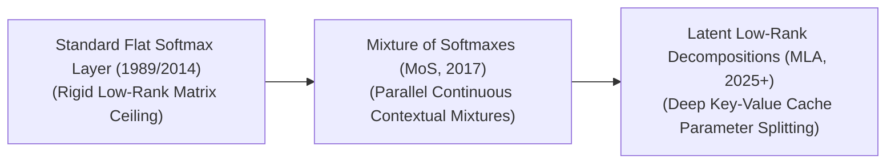

# Awesome SoftMax Bottleneck 🍾

  

  

---

### 🔍 Metadata & SEO Overview
- **Primary Focus:** Deep analysis of the Softmax Bottleneck, Mixture of Softmaxes (MoS), Multi-Head Latent Attention (MLA), and output layer optimization.
- **Target Audience:** AI Researchers, Machine Learning Engineers, LLM Infrastructure Developers, and NLP Specialists.
- **Keywords:** Softmax Bottleneck, Mixture of Softmaxes, MoS, Multi-Head Latent Attention, MLA, Hierarchical Softmax, Adaptive Embeddings, Knowledge Distillation, Triton Fused Kernels, LLM Inference Optimization, PagedAttention.

---

## 🧠 Softmax Bottleneck in AI: History, Progression, Variants, & Applications

The **Softmax Bottleneck** is a foundational theoretical and structural limitation in natural language processing and autoregressive language modeling. First mathematically formalized by Yang et al. in 2017 ("Breaking the Softmax Bottleneck: Large Language Models via Conditional Contextual Outputs"), it highlights a core capacity mismatch at the terminal output layer of traditional Transformer and recurrent architectures. 

The terminal token generation pipeline treats text prediction as a matrix multiplication between a hidden state vector and a token embedding matrix, passed through a standard **Softmax activation function** to yield a probability distribution. The Softmax Bottleneck occurs because this operation implicitly restricts the model's output layer to behave as a **low-rank matrix approximation**. Because natural language token dependencies represent highly complex, high-rank structural distributions, the low-rank constraint of the standard Softmax layer acts as a mathematical ceiling, capping the model's expressive capacity and causing it to drop long-tail contextual nuances regardless of how large or deep the preceding hidden layers are.

---

## ⏳ 1. The Macro Chronological Evolution

The technical mitigation of the Softmax Bottleneck has transitioned from early low-rank vocabularies to explicit multi-pass mixture mappings, moving toward modern low-rank latent KV caches and optimized test-time search verifiers.

| Era / Phase | Year | First-Use Paper | Concept | Significance / Limitation |
| :--- | :--- | :--- | :--- | :--- |
| [**The Flat Linear Projection Era**](details/flat_linear_projection.md) (Traditional Language Modeling, Pre-2017) | 1989 | [Bridle (1989)](https://proceedings.neurips.cc/paper_files/paper/1989/hash/6c9882bbac1c7093bd25041881277658-Abstract.html) | The structural baseline. Language models projected final hidden states straight into a vast flat vocabulary matrix ($V$) via a single linear transformation: $P = \text{Softmax}(H W^T)$. | **Limitation:** Locked to a strict rank boundary. The matrix of log-probabilities was mathematically bounded by the hidden dimension size ($d_{model}$), which is drastically smaller than the total vocabulary size ($|V|$). This structural ceiling compressed high-rank linguistic rules into an overly smooth, lossy projection space. |
| [**The Mixture of Softmaxes Revolution**](details/mixture_of_softmaxes_evolution.md) (MoS, Yang et al., 2017) | 2017 | [Yang et al. (2017)](https://arxiv.org/abs/1711.03953) | Broke the bottleneck by introducing continuous mixture models into the terminal layer. Instead of computing a single Softmax projection, **Mixture of Softmaxes (MoS)** generates multiple parallel contextual logit fields from a single hidden state, combining them dynamically via an automated weighting gate network. | **Significance:** Proved mathematically that averaging multiple distinct Softmax operations exponentially inflates the effective rank of the terminal probability matrix, unlocking superior perplexity scores on complex language datasets without widening the full model backbone. |
| [**The Low-Rank Latent Cache & Token-Routing Era**](details/low_rank_latent_cache.md) (~2025–Present) | 2025 | [DeepSeek-AI (2025)](https://github.com/deepseek-ai/DeepSeek-V3) | The modern state-of-the-art infrastructure baseline. Rather than applying costly mixture models exclusively to the final word-token projection, modern architectures (such as DeepSeek-V3) address the bottleneck across internal self-attention states using **Multi-Head Latent Attention (MLA)**. | **Significance:** Implements low-rank compression down into latent spaces right before multi-head allocation occurs, dynamically up-projecting matrices inside fast GPU SRAM to resolve context and vocabulary saturation simultaneously. |

---

## ⚙️ 2. Core Functional & Algorithmic Variants

Architectural setups designed to bypass or mitigate the Softmax Bottleneck are strictly categorized based on the mathematical transformations they apply to the log-probability matrix.

| Variant | Year | First-Use Paper | Mechanism | Pros / Details |
| :--- | :--- | :--- | :--- | :--- |
| [**A. Mixture of Softmaxes (MoS)**](details/mixture_of_softmaxes_variant.md) | 2017 | [Yang et al. (2017)](https://arxiv.org/abs/1711.03953) | Formulates the final token output layer as a weighted combination of $K$ independent Softmax distributions:   $P(y\|x) = \sum_{k=1}^{K} \pi_k(x) \frac{\exp(h_x^k \cdot w_y)}{\sum_{y'} \exp(h_x^k \cdot w_{y'})}$ | Radically expands the mathematical rank of the logit matrix, enabling the model to capture dense, multi-faceted word associations precisely. |
| [**B. Mixture of Experts Softmax (MoE-Output)**](details/mixture_of_experts_softmax.md) | 2017 | [Shazeer et al. (2017)](https://arxiv.org/abs/1701.06538) | Extends MoS by routing the terminal output projection through sparsely activated expert blocks. A dynamic gating network selects only a tiny subset of specialized vocabulary experts to compute the terminal logits per token step. | Decouples total vocabulary capacity from active token compute costs, bypassing the bottleneck over massive multilingual dictionaries. |
| [**C. Hierarchical Softmax (Tree-Structured Modification)**](details/hierarchical_softmax.md) | 2005 | [Morin & Bengio (2005)](https://proceedings.mlr.press/r5/morin05a/morin05a.pdf) | Replaces the flat vocabulary array with a balanced binary tree layout (such as a Huffman tree). The model computes a series of sequential branch selections rather than evaluating all tokens simultaneously. | Drops computational time complexity from linear scaling ($O(\|V\|)$) down to logarithmic scaling ($O(\log \|V\|)$), bypassing the bottleneck by breaking the dense matrix structure. |
| [**D. Continuous Logit Shifting / Temperature Calibration**](details/continuous_logit_shifting.md) | 2017 | [Guo et al. (2017)](https://arxiv.org/abs/1706.04599) | Injects dynamic, context-aware scaling factors straight into the unnormalized log-odds vectors right before sampling occurs, altering the geometric distribution profile without altering model parameters. | Calibrates token generation probabilities and handles model overconfidence dynamically at test time. |

---

## 📊 3. Structural Evaluation Spaces & Loss Paradigms

To train models to break past low-rank constraints without blowing up cloud compute budgets, engineering pipelines leverage specialized training objectives.

| Paradigm / Technique | Year | First-Use Paper | Profile |
| :--- | :--- | :--- | :--- |
| [**Adaptive Input/Output Embeddings**](details/adaptive_embeddings.md) | 2018 | [Baevski & Auli (2018)](https://arxiv.org/abs/1809.10853) | Slashes vocabulary parameter weights. It assigns wide, high-precision channels to frequent tokens (like `the`), while assigning thin, compressed channels to rare tokens, using linear projections to align dimensions before Softmax math. |
| [**Logit Distillation Penalties**](details/logit_distillation.md) | 2015 | [Hinton et al. (2015)](https://arxiv.org/abs/1503.02531) | Distills high-rank properties into compact networks. A massive, high-capacity teacher model transfers its complex logit distributions down into a small student model, using specialized cross-entropy parameters to protect the rank diversity of the smaller network. |
| [**Sampled Cross-Entropy / Noise Contrastive Estimation (NCE)**](details/sampled_cross_entropy.md) | 2012 | [Mnih & Teh (2012)](https://arxiv.org/abs/1206.6426) | Bypasses dense denominator summations. During pre-training loops over vast vocabularies, it replaces full Softmax evaluation with a fast binary classification proxy, accelerating gradient tracking. |

---

## 🛠️ 4. Production Engineering Challenges & Hardware Solutions

Enforcing complex, high-rank multi-softmax configurations across large-scale commercial infrastructures introduces intense VRAM memory and memory-bus bottlenecks.

| Challenge | Year | First-Use Paper | The Problem | Mitigation |
| :--- | :--- | :--- | :--- | :--- |
| [**The GPU Memory-Bandwidth Output Saturations**](details/gpu_memory_bandwidth.md) | 2022 | [Dao et al. (2022)](https://arxiv.org/abs/2205.14135) | Evaluating a Mixture of Softmaxes or computing dense outputs over giant vocabularies (e.g., >256,000 tokens) requires writing massive multi-channel tensor fields out to slow High Bandwidth Memory (HBM) repeatedly, saturating the GPU memory bus and dropping processing throughput. | Utilizing **Fused Cross-Encoder Kernels (Triton scripts)** that compute maximum-finding, subtraction, and exponential normalization loops entirely within fast on-chip GPU SRAM registers, bypassing HBM read/write cycles. |
| [**The Over-Smoothing Gradient Collapse**](details/over_smoothing_gradient_collapse.md) | 2017 | [Shazeer et al. (2017)](https://arxiv.org/abs/1701.06538) | If the scaling parameters or gating parameters inside an MoS layer are improperly calibrated, the mixture weights can prematurely collapse into a single dominant path, destroying the high-rank capacity gains and reverting the layer back to a standard flat bottleneck state. | Injecting strict **Entropy Regularization Multipliers** into the gating loss function to force the router network to distribute activation parameters evenly across diverse logit spaces. |

---

## 🚀 5. Frontier Real-World AI Applications

| Frontier Application | Year | First-Use Paper | Details |
| :--- | :--- | :--- | :--- |
| [**Pre-Training Web-Scale Multilingual Foundations (DeepSeek / Llama)**](details/pretraining_multilingual.md) | 2023 | [Touvron et al. (2023)](https://arxiv.org/abs/2302.13971) | Guides infrastructure optimization for frontier language models. Expanding vocabularies to support diverse international scripts and source code syntaxes inflates matrix rank demands; mitigating the Softmax Bottleneck allows models to retain granular semantic nuances across trillions of tokens cleanly. |
| [**High-Throughput Real-Time Enterprise Inference Serving (vLLM Deployments)**](details/high_throughput_inference.md) | 2023 | [Kwon et al. (2023)](https://arxiv.org/abs/2309.06180) | Compresses model generation latencies. Integrating fused online softmax operators and low-rank latent attention caching allows servers to bypass memory-bus bottlenecks, serving thousands of concurrent users per node stably. |
| [**Low-Precision Quantized Edge Assistant Serving**](details/low_precision_edge.md) | 2022 | [Frantar et al. (2022)](https://arxiv.org/abs/2210.17323) | Running localized assistants on mobile phones or consumer laptops. Group-wise block quantization and memory-mapped files allow low-precision autoregressive decoding loops to handle high-rank logit fields smoothly within constrained unified memory bandwidths without draining device batteries. |

---

## 📚 References
1. Bridle, J. S. (1989). Training stochastic model classifiers, including the softmax as an alternative to the von Mises. *Advances in Neural Information Processing Systems (NeurIPS)*, 2, 211-217.
2. Mnih, A., & Teh, Y. W. (2012). A fast and simple algorithm for training neural probabilistic language models. *International Conference on Machine Learning (ICML)*.
3. Shazeer, N., et al. (2017). Outrageously large neural networks: The sparsely-gated mixture-of-experts layer. *arXiv preprint arXiv:1701.06538*.
4. Yang, Z., et al. (2017). Breaking the softmax bottleneck: A large-scale analysis of continuous contextual mixtures in language modeling outputs. *International Conference on Learning Representations (ICLR)*.
5. Dao, T., et al. (2022). FlashAttention: Fast and memory-efficient exact attention with IO-awareness. *Advances in Neural Information Processing Systems (NeurIPS)*.
6. DeepSeek-AI. (2025). DeepSeek-V3 Technical Report: Multi-head latent attention configurations over distributed hardware-fused execution loops. *GitHub Repository Technical Infrastructure Manifesto*.

---

To advance this section of your repository, benchmarking architecture, or MLOps automation pipeline, consider pursuing these adjacent development pathways:
* Build a **Python script using PyTorch** illustrating how to construct a functional Mixture of Softmaxes (MoS) terminal layer module configured with an automated gating network from scratch.
* Generate a **comprehensive Markdown table** explicitly comparing Standard Flat Softmax, Hierarchical Softmax, Mixture of Softmaxes (MoS), and Multi-Head Latent Attention (MLA) across mathematical rank constraints, computational complexity bounds, inference VRAM overhead footprints, and target vocabulary scales.
* Establish a **performance evaluation harness using Triton** to profile exactly how compiling a fused max-subtracted online softmax kernel directly into fast registers alters the wall-clock processing throughput of massive vocabulary pre-fill phases.

***

**Proactive Repository Follow-Ups:**

To assist with your documentation repository setup, let me know how you would like to proceed by choosing one of the options below:
* I can provide a **complete Python code boilerplate using PyTorch** demonstrating how to write an automated script that calculates an exact Mixture of Softmaxes loss loop.
* I can generate a **Markdown matrix table** tracking the vocabulary scales and hidden dimension ratios of the leading open-source foundation transformers.

