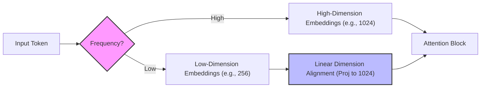

# Adaptive Input/Output Embeddings

To slash vocabulary parameter sizes, adaptive embeddings allocate variable projection channel widths according to token frequencies.

## Concept

Frequent tokens (e.g., `"the"`) receive wide, high-dimension embedding channels to capture rich semantics. Rare tokens receive thin, compressed channels. Linear projection layers are used to map these variable dimensions back to the hidden size before performing standard softmax operations.

## Diagram

---
[Back to README](../README.md)
