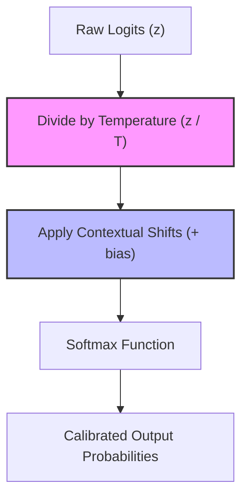

# Continuous Logit Shifting / Temperature Calibration

Continuous logit shifting alters the geometric distribution profile of the terminal log-odds vectors dynamically at test time.

## Mechanism

By applying scale parameters (temperature $T$) or bias shifts, the output probability distribution is modified without altering internal weights:

$$P(y_i) = \frac{\exp(z_i / T)}{\sum_{j} \exp(z_j / T)}$$

This allows for custom calibration of prediction confidence and entropy.

## Diagram

---
[Back to README](../README.md)
