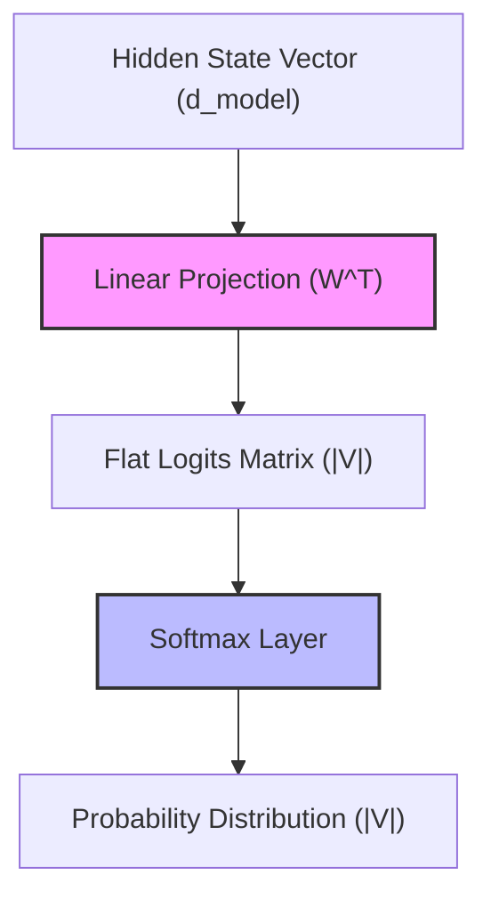

# Flat Linear Projection Era

In traditional language modeling (pre-2017), the terminal output layer of neural network models projected final hidden states straight into a vast flat vocabulary matrix ($V$) via a single linear transformation:

$$P = \text{Softmax}(H W^T)$$

## Theoretical Bottleneck

The logit matrix ($H W^T$) has a mathematical rank that is bounded by the hidden dimension size ($d_{\text{model}}$):

$$\text{Rank}(H W^T) \le \min(d_{\text{model}}, |V|)$$

Because $d_{\text{model}} \ll |V|$ in practice (e.g., $d_{\text{model}} \approx 1024$, $|V| \approx 100,000$), the output probability matrix is a low-rank approximation. Natural language exhibits complex high-rank token dependencies, which means standard flat linear projection acts as a mathematical bottleneck, compressing high-rank linguistic rules into an overly smooth, lossy projection space.

## Diagram

---
[Back to README](../README.md)
