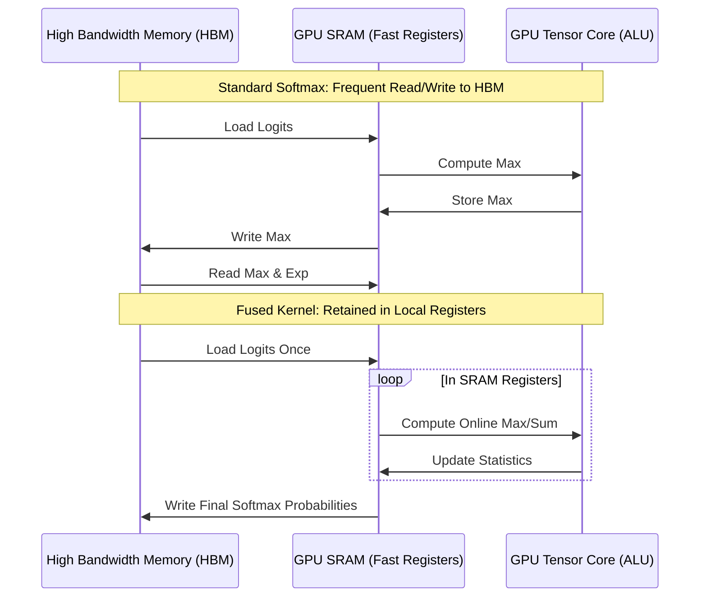

# GPU Memory-Bandwidth Output Saturations

Evaluating Mixture of Softmaxes or calculating logits over massive vocabularies creates high-latency memory bottlenecks during production serving.

## The Problem

Transferring massive intermediate matrices back and forth between GPU High Bandwidth Memory (HBM) and SRAM registers saturates the memory bus, causing computational execution stalls.

## Fused Kernels (FlashAttention / Triton)

Fused kernels write custom GPU code to perform multiple softmax and reduction operations (e.g., Online Softmax) entirely inside fast SRAM registers, bypassing costly HBM read/write roundtrips.

## Diagram

---
[Back to README](../README.md)
