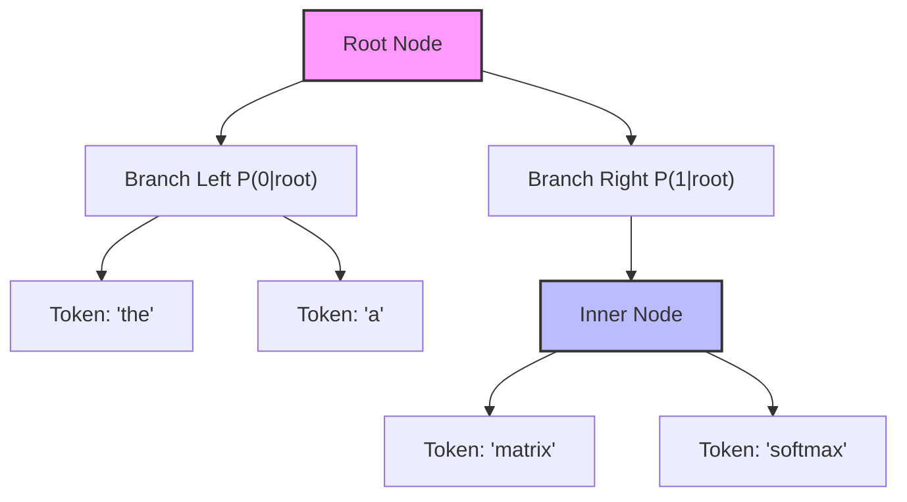

# Hierarchical Softmax

Hierarchical Softmax is an optimization technique designed to bypass the $O(|V|)$ computational bottleneck of flat softmax layers.

## Mechanism

By organizing the vocabulary into a tree structure (typically a Huffman tree), token prediction is converted into a series of hierarchical binary decisions. The probability of selecting a leaf token is the product of path decision probabilities from the root:

$$P(w) = \prod_{i=1}^{L(w)} P(d_i | \text{node}_i)$$

This reduces time complexity from $O(|V|)$ to $O(\log |V|)$.

## Diagram

---
[Back to README](../README.md)
