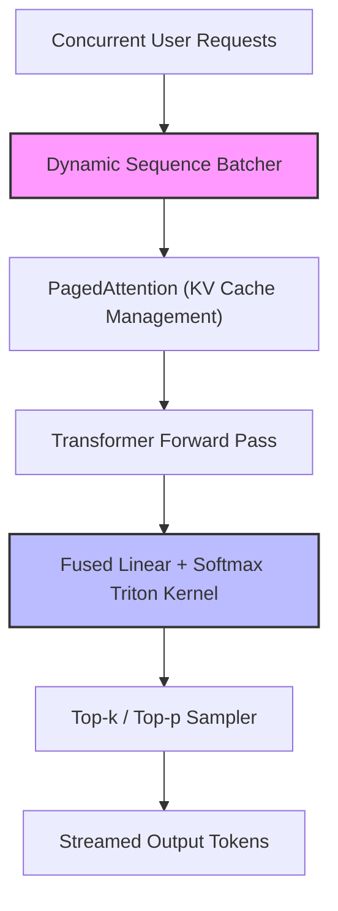

# High-Throughput Real-Time Enterprise Inference Serving

Serving massive language models concurrently to thousands of users requires optimizing the terminal softmax projection layer to minimize token latency.

## Key Serving Bottlenecks

1. **Memory-Bus Saturation:** Reading and writing large vocabulary matrices from HBM memory to SRAM during the autoregressive generation loop.
2. **Key-Value Cache Expansion:** Storing long sequence histories of key-value activations for multi-user sessions.

## Serving Solutions

1. **vLLM PagedAttention:** Avoids contiguous memory allocation and fragments memory pages dynamically, reducing cache overhead.
2. **Fused Triton Kernels:** Fuses the final logit linear projection and softmax calculation, avoiding writing large output matrices to main memory.

## Diagram

---
[Back to README](../README.md)
