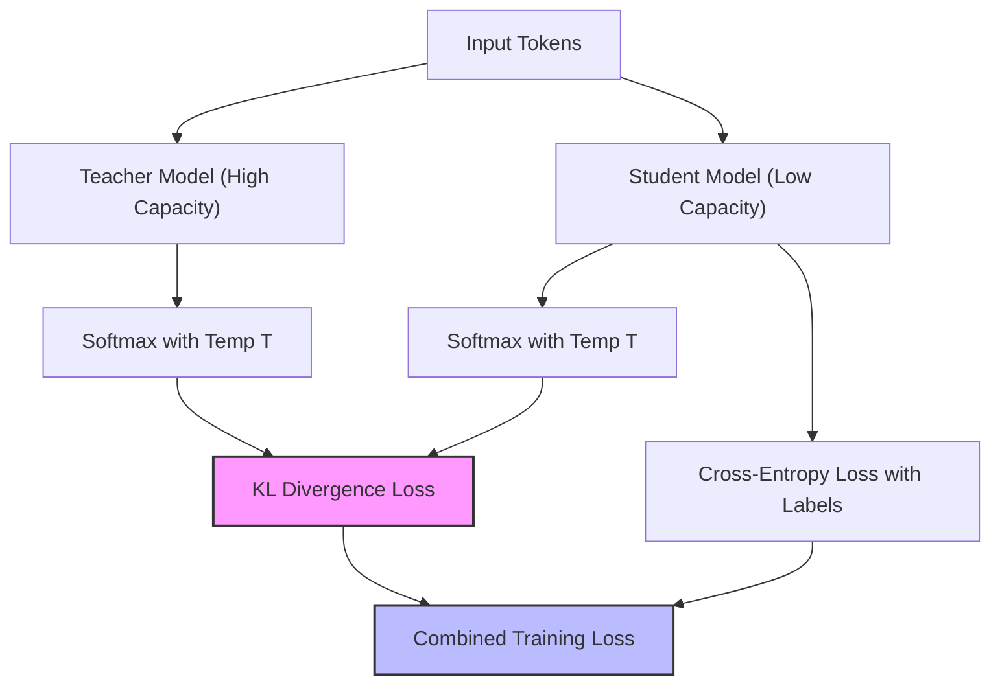

# Logit Distillation Penalties

Logit distillation transfers high-rank properties and structural diversity from massive models down to smaller ones.

## Mechanism

During training, the student model's loss is calculated as a blend of standard cross-entropy and logit distance (Kullback-Leibler divergence) relative to a high-capacity teacher model's outputs:

$$\mathcal{L} = (1 - \alpha) \mathcal{L}_{CE}(y, p_{student}) + \alpha T^2 \mathcal{L}_{KL}(p_{teacher}^T, p_{student}^T)$$

This forces the smaller model to respect and learn the rank diversity of the larger projection space.

## Diagram

---
[Back to README](../README.md)
