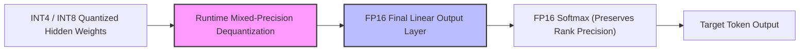

# Low-Precision Quantized Edge Assistant Serving

Deploying models on resource-constrained edge devices (e.g., mobile phones, smart devices) requires extreme parameter compression.

## The Challenge

Standard high-precision parameters (FP16/BF16) require more memory bandwidth and storage than edge hardware provides. Quantizing these parameters to INT4/INT8 reduces memory footprint but can cause severe output rank collapse and representation errors in the final softmax layer.

## Optimization Strategies

1. **Post-Training Quantization (GPTQ / AWQ):** Intelligently rounds weights using second-order Taylor approximations to preserve model accuracy.
2. **Mixed-Precision Projections:** Keeps the final linear projection and Softmax layers in higher precision (FP16) while keeping internal attention calculations in quantized INT4.

## Diagram

---
[Back to README](../README.md)
