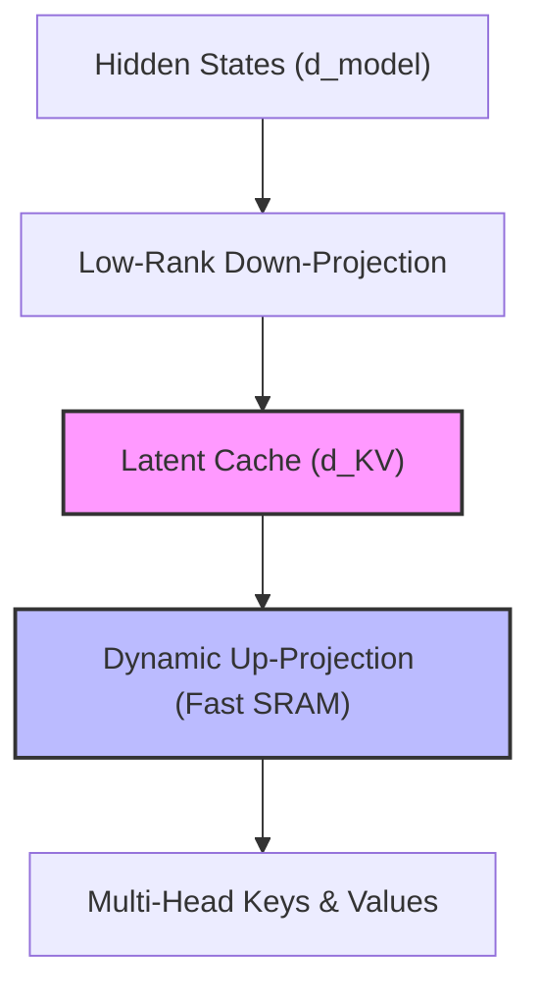

# Low-Rank Latent Cache & Token-Routing Era

Modern autoregressive transformer architectures (e.g., DeepSeek-V3) address attention caching overhead and the softmax bottleneck simultaneously using low-rank latent representation projections.

## Concept

In standard multi-head attention (MHA), the Key-Value (KV) cache grows linearly with context length. In **Multi-Head Latent Attention (MLA)**, KV projections are compressed into a low-rank latent space:

$$d_{KV} \ll d_{model}$$

During attention calculation, the latent representations are dynamically up-projected inside fast SRAM to restore the keys and values. This structure acts as an internal low-rank cache that decouples cache size from hidden dimensions.

## Diagram

---
[Back to README](../README.md)
