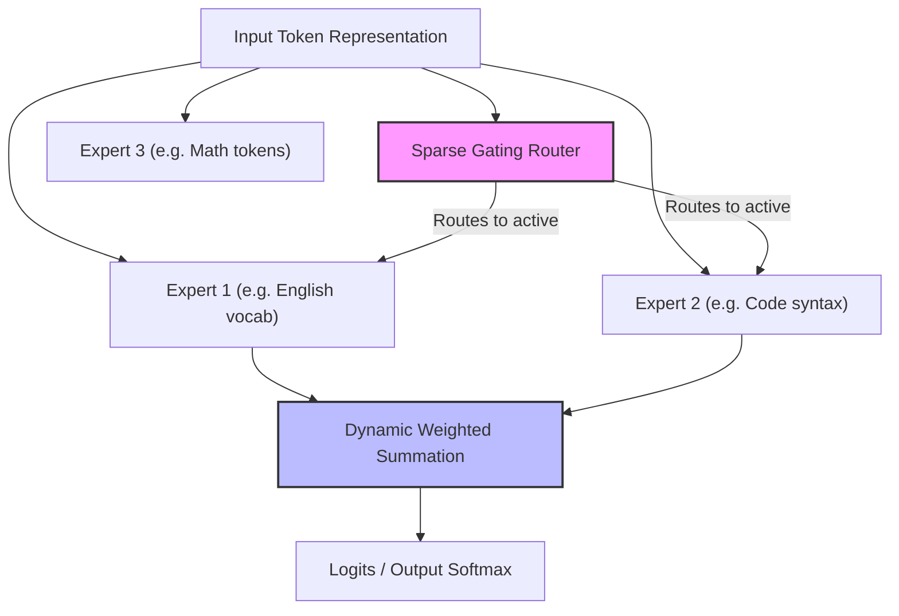

# Mixture of Experts Softmax (MoE-Output)

The Mixture of Experts (MoE) Output layer extends Mixture of Softmaxes by sparsely routing token predictions through specialized vocabulary modules.

## Mechanism

Instead of all experts firing for every word, a sparse gating router selects a subset of experts ($Top\text{-}k$) to compute final logits:

$$y = \sum_{i \in \text{selected}} G(x)_i E_i(x)$$

This decoupling allows models to scale the parameters dedicated to vocabulary and multi-lingual translations without scaling active compute cost.

## Diagram

---
[Back to README](../README.md)
