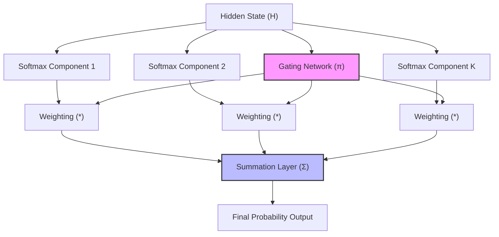

# Mixture of Softmaxes (MoS) Evolution

The Mixture of Softmaxes (MoS) was introduced in 2017 to break the Softmax Bottleneck in neural language models.

## Concept

Instead of projecting the hidden state through a single linear transformation and softmax, MoS models the output probability as a continuous mixture of $K$ distinct Softmax distributions.

$$P(y|x) = \sum_{k=1}^{K} \pi_k(x) \frac{\exp(h_x^k \cdot w_y)}{\sum_{y'} \exp(h_x^k \cdot w_{y'})}$$

This formulation exponentially inflates the mathematical rank of the terminal probability matrix without widening the full model backbone, capturing diverse contextual nuances.

## Diagram

---
[Back to README](../README.md)
