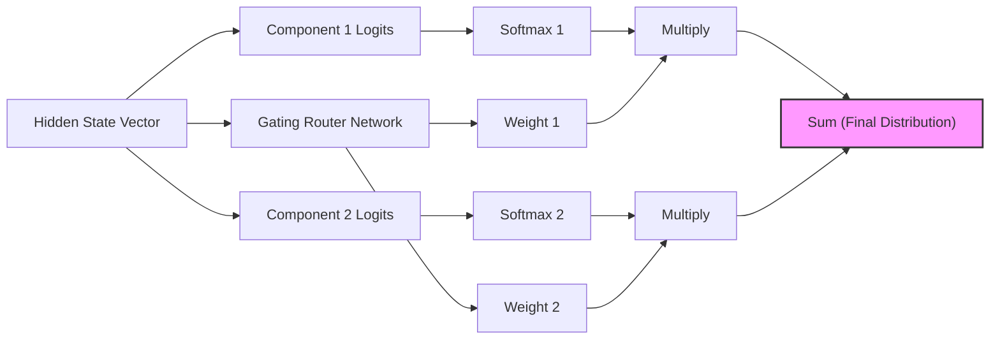

# Mixture of Softmaxes (MoS) Algorithmic Variant

As an architectural modification, Mixture of Softmaxes (MoS) mathematically breaks the low-rank constraints of the logit matrix.

## Mechanism

Instead of a single softmax calculation, MoS computes $K$ separate softmax projections from scaled, transformed hidden state vectors:

$$P(y|x) = \sum_{k=1}^{K} \pi_k(x) \frac{\exp(h_x^k \cdot w_y)}{\sum_{y'} \exp(h_x^k \cdot w_{y'})}$$

The continuous contextual mixture dynamically expands the rank ceiling of the softmax output layer.

## Diagram

---
[Back to README](../README.md)
