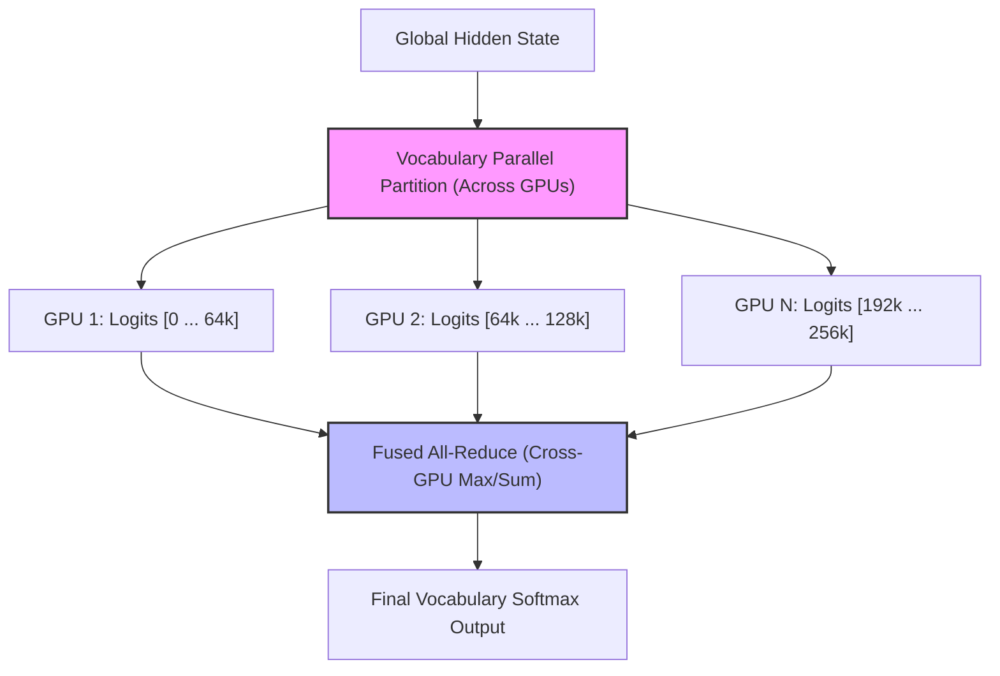

# Pre-Training Web-Scale Multilingual Foundations

Optimizing the output projection layer is critical when training large foundation language models (e.g., Llama, DeepSeek) over multi-trillion token multilingual corpora.

## The Challenge

Supporting thousands of languages, rare character scripts, and source code symbols forces the model's vocabulary size $|V|$ to expand significantly (e.g., >256,000 tokens). This requires high-rank projections to capture sub-word semantics and prevent translation loss.

## Solutions

Foundation models employ structural remedies such as:
1. Tied embeddings (sharing input and output matrices).
2. Group-based vocabulary partition across multiple GPUs.
3. Multi-Head Latent Attention (MLA) to reduce key-value storage requirements while preserving modeling precision.

## Diagram

---
[Back to README](../README.md)
