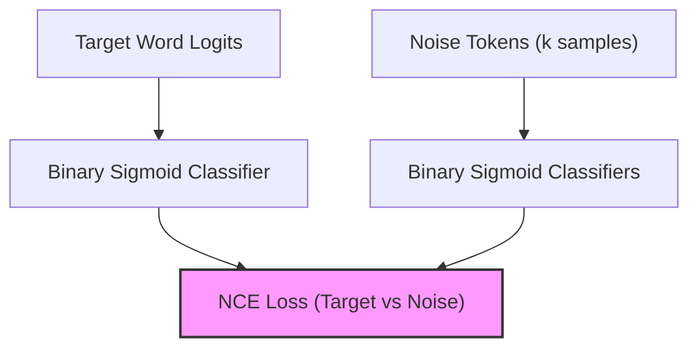

# Sampled Cross-Entropy / Noise Contrastive Estimation (NCE)

To avoid computing costly dense denominator summations over massive vocabularies during training, sampled softmax approaches are used.

## Mechanism

Noise Contrastive Estimation (NCE) reformulates the multiclass token classification problem into a binary logistic regression problem. For each target word, the model compares the target token score against a small set of randomly sampled "noise" tokens:

$$\mathcal{L}_{NCE} = - \log P(D=1 | w_{target}) - \sum_{j=1}^{k} \log P(D=0 | w_{noise, j})$$

This avoids calculating the partition function (softmax denominator) over the entire vocabulary $V$.

## Diagram

---
[Back to README](../README.md)
